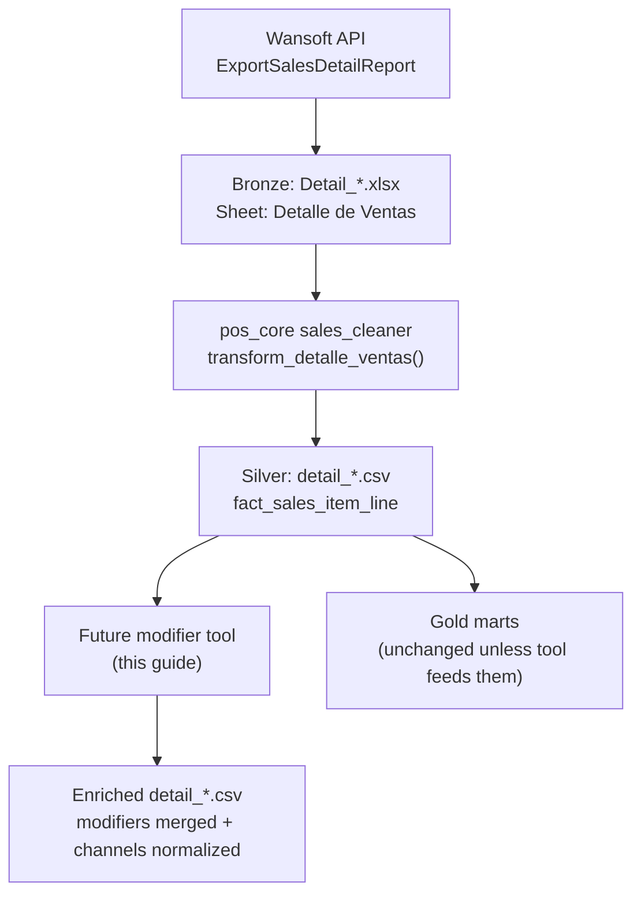

# Detalle de Venta — Modifier Enrichment Guide

Guide for building a tool that processes Wansoft **Detalle de Ventas** sales-detail data and rewrites product names on selected items so that:

1. **Item-defining modifiers** are folded into the `item` field (e.g. `CAFE REFILL` + modifier `REGULAR` → `cafe refill regular`).
2. **Delivery-channel duplicates** (Uber, Rappi, DiDi) are optionally merged into the same canonical name as in-store items (e.g. `CONCHA UBER` + modifier `CHOCOLATE` → `concha chocolate`, identical to in-store `CONCHA CHOCOLATE`).

This document is based on:

- The `pos-core-etl` pipeline used by `front-weekly-sales`
- Real cleaned CSV exports from Panem branches (Nov–Dec 2025, ~31k item/modifier lines across 12 branch-week files)
- Source code in `pos_core/etl/staging/sales_cleaner.py`

---

## 1. What this repo does (and does not do)

`front-weekly-sales` is a thin orchestrator. It calls `pos_core.sales.marts.fetch_group()` and sends the **category pivot** CSV to Telegram. It does **not** parse detalle de venta or handle modifiers at the product level.

All detalle logic lives in the external dependency **`pos-core-etl`** (`import pos_core`):

| Layer | Path | Grain | Used by weekly report? |
|-------|------|-------|------------------------|
| Bronze | `data/a_raw/sales/batch/Detail_<branch>_<start>_<end>.xlsx` | Raw Excel | No |
| Silver | `data/b_clean/sales/batch/detail_<sucursal>_<start>_<end>.csv` | One row per item **or** modifier line | No |
| Gold (ticket) | `data/c_processed/sales/mart_sales_by_ticket_*.csv` | One row per ticket | Partially (ticket stats) |
| Gold (group) | `data/c_processed/sales/mart_sales_by_group_*.csv` | Category × branch pivot | **Yes — Telegram CSV** |

**The future modifier tool must work at the Silver layer** (`fact_sales_item_line`). The weekly group mart collapses products into ~10 categories and routes modifier groups (`MOD BEBIDAS`, `MOD ALIMENTOS`) into `EXTRAS y MISC`, so SKU-level modifier logic is invisible there.

### Recommended API entry point

```python
from pathlib import Path
from pos_core import DataPaths
from pos_core.sales import core as sales_core

paths = DataPaths.from_root("data", Path("sucursales.json"))
df = sales_core.fetch(paths, "2025-12-01", "2025-12-07", mode="force")
# df is the silver fact at item/modifier line grain
```

Or read existing silver CSVs directly from `data/b_clean/sales/batch/detail_*.csv`.

**Do not re-implement Excel parsing.** The future tool should consume silver output from `pos_core.sales.core.fetch()` or `detail_*.csv` files. See §2 for exactly what is already done.

---

## 2. What pos-core-etl pre-cleans (and what it does not)

This section answers: *can the future modifier tool skip work because `pos-core-etl` already did it?*

**Short answer:** Yes for all **structural** cleaning (headers, types, Excel quirks). No for all **semantic** product work (modifiers, channels, canonical names). The future tool is a thin enrichment layer on top of silver — not a second ETL.

### 2.1 Pipeline layers — what each stage touches

| Stage | Module | Input → output | Touches `item` / `modifier`? |
|-------|--------|----------------|------------------------------|
| Bronze | `pos_core.sales.extract` | Wansoft API → `.xlsx` | No — raw bytes |
| **Silver** | `pos_core.etl.staging.sales_cleaner` | `.xlsx` → `detail_*.csv` | **Reads** `item`/`modifier`; does not rewrite them |
| Gold (ticket) | `pos_core.etl.marts.sales_by_ticket` | silver → ticket mart | **Ignores** `item` — sums by `group` only |
| Gold (group) | `pos_core.etl.marts.sales_by_group` | ticket mart → pivot | **Collapses `group`** via `RAW_MAP`; never sees `item` |

Verified on a live Kavia export: `transform_detalle_ventas()` output matches saved `detail_*.csv` column-for-column (46 columns). Product names pass through unchanged (still UPPERCASE, accents preserved).

### 2.2 What silver cleaning **already does** (skip in future tool)

Implemented in `sales_cleaner.transform_detalle_ventas()` + `cleaning_utils.py`:

| Done by pos-core-etl | Detail | Future tool action |
|----------------------|--------|-------------------|
| Sheet detection | Finds **"Detalle de Ventas"** sheet case-insensitively | Skip |
| Header row detection | Scans for `Día` / `Fecha de operación` sentinels | Skip |
| Branch extraction | Parses `Sucursal: …` from top metadata → `sucursal` column | Skip |
| Column rename | Spanish headers → snake_case English (`item`, `modifier`, `is_modifier`, …) | Skip — read normalized names |
| Duplicate amount columns | Four blocks disambiguated: `subtotal_ticket`, `subtotal_item`, `subtotal_cortesia_cancel`, `subtotal_anulacion` | Skip |
| Text hygiene on all object cols | `strip_invisibles()` — NBSP, zero-width chars, collapsed whitespace | Skip (already applied to `item`, `modifier`, `description`) |
| Formula injection guard | `neutralize()` on object columns | Skip |
| Type coercion | `operating_date` → date; amounts → float via `to_float()` | Skip |
| `is_modifier` parsing | `sí`/`no` → `True`/`False` boolean | **Use directly** — do not re-parse |
| Stable column order | Front-loads key columns (`sucursal`, `order_id`, `item`, `modifier`, …) | Skip |
| UTF-8 CSV output | `detail_<sucursal>_<start>_<end>.csv` | Read or call `sales_core.fetch()` |

**Reusable utilities** (import rather than duplicate):

```python
from pos_core.etl.staging.cleaning_utils import (
    strip_invisibles,
    remove_accents,
    normalize_spanish_name,
)
```

Use `remove_accents` / `normalize_spanish_name` for output name folding — same helpers the ETL already uses for header matching.

### 2.3 What silver cleaning **does not do** (future tool must do)

| Not done by pos-core-etl | Why the future tool still needs it |
|--------------------------|-----------------------------------|
| Merge modifier rows into `item` | `item` and `modifier` stay as separate rows; `CAFE REFILL` + `REGULAR` remain two lines |
| Link modifier child → parent base row | No parent pointer column; linking is by `order_id` + row order + matching `item` |
| Canonical / lowercase product names | Names stay exactly as Wansoft prints them (`CONCHA VAINILLA`, not `concha vainilla`) |
| Delivery channel normalization | `CONCHA UBER`, `LATTE 16OZ UBER` keep channel suffix on `item` |
| Split in-store vs delivery conchas | In-store: `CONCHA CHOCOLATE`; Uber: `CONCHA UBER` + modifier `CHOCOLATE` — different shapes |
| Drop zero-revenue modifier rows | All rows kept; modifier lines have `subtotal_item = 0` |
| Product-level aggregation | No SKU dimension beyond raw `item` + `clave_platillo` |

### 2.4 What gold marts do (misleading shortcuts — do not use)

**`sales_by_group.RAW_MAP`** partially addresses delivery channels at the **category** level only:

```python
# pos_core/etl/marts/sales_by_group.py
"UBER PAN DULCE": "PAN DULCE",
"RAPPI PAN DULCE": "PAN DULCE",
"MOD BEBIDAS": "EXTRAS y MISC",
"MOD ALIMENTOS": "EXTRAS y MISC",
```

This helps the weekly Telegram pivot but:

- Operates on **`group`**, not `item` — `CONCHA UBER` and `CONCHA CHOCOLATE` are never unified
- Runs **after** ticket aggregation — `item` column is already gone
- Modifier revenue rolls into `EXTRAS y MISC` — loses product attribution

**`sales_by_ticket`** sums `subtotal_item` by `(ticket, group)` — ignores `item`, `modifier`, `is_modifier` entirely.

**Conclusion:** Gold marts are the wrong input layer for the modifier tool. Do not try to reverse-engineer item names from `mart_sales_by_ticket_*.csv`.

### 2.5 Simplified future tool architecture

Because silver is already clean, the future tool is **one pass** on a DataFrame:

```
pos_core.sales.core.fetch()  OR  read detail_*.csv
        ↓
  [enricher]  link modifiers → rewrite item → strip channels
        ↓
  detail_enriched_*.csv  (same 46-column schema)
```

**Do not build:**

- Excel reader / header detector
- Spanish column mapper
- Amount-block disambiguator
- `is_modifier` string parser

**Do build:**

- Per-`order_id` modifier linker (§5)
- Config-driven name templates (§8–§9)
- Channel strip + optional `original_item` / `sales_channel` audit columns (§6)

### 2.6 Input contract the future tool can rely on

After `sales_core.fetch()`, these invariants hold (verified on real data):

| Column | Guaranteed shape |
|--------|------------------|
| `item` | String, stripped of invisible chars, UPPERCASE as in POS |
| `modifier` | String or empty/NaN on base rows; filled on modifier rows |
| `is_modifier` | Boolean (`True`/`False`), not raw `sí`/`no` |
| `order_id` | Ticket grouping key (with `sucursal` + `operating_date` for uniqueness) |
| `clave_platillo` | SKU code string (may appear as trailing column; same as `item_key` in docs) |
| `group` | Raw Wansoft category — includes `UBER PAN DULCE`, `MOD BEBIDAS`, etc. |
| `subtotal_item` | Float; > 0 on base items, usually 0 on modifier rows |
| `description` | Human summary on base rows, often lists modifiers (useful for validation) |
| Row order within `order_id` | Modifier rows follow their parent ~98% of the time |

### 2.7 Optional: enrich before or after gold marts

| Approach | Pros | Cons |
|----------|------|------|
| **Enrich silver, then rebuild marts** | Item-level truth propagates to any downstream mart | Must fork/re-run gold aggregation |
| **Enrich silver only (recommended v1)** | Minimal scope; no risk to Telegram CSV contract | Weekly report unchanged |
| **Patch gold marts only** | None for item work | Cannot recover item/modifier detail — wrong layer |

For v1, write `detail_enriched_*.csv` alongside silver. Do not alter `mart_sales_by_group_*.csv` unless explicitly requested.

---

## 3. End-to-end data flow



### Download (Bronze)

- **Endpoint:** `ExportSalesDetailReport` (report type `"Detail"`)
- **Env vars:** `WS_BASE`, `WS_USER`, `WS_PASS`
- **Branches:** `sucursales.json` maps short names (e.g. `Kavia`) to Wansoft subsidiary codes with `valid_from` / `valid_to` windows
- **Output naming:** `Detail_<branch>_<start>_<end>.xlsx`

### Clean (Silver)

`pos_core.etl.staging.sales_cleaner.transform_detalle_ventas()`:

1. Opens sheet **"Detalle de Ventas"** (case-insensitive)
2. Auto-detects header row (sentinels: `Día`, `Fecha de operación`)
3. Parses branch from top metadata (`Sucursal: …`)
4. Maps Spanish headers → snake_case English
5. Disambiguates four duplicate amount blocks: `ticket`, `item`, `cortesia_cancel`, `anulacion`
6. Coerces types; writes UTF-8 CSV

**pandas pin:** `pandas>=1.3.0,<3` — pandas 3 breaks header detection in `sales_cleaner`.

---

## 4. Silver CSV schema (`fact_sales_item_line`)

**Grain:** one row per item line **or** modifier line on a ticket.

**Logical key:** `(sucursal, operating_date, order_id, clave_platillo, is_modifier, captured_time)` — use row order within `order_id` for parent–child linking.

### Core columns

| Column | Spanish source | Role |
|--------|----------------|------|
| `sucursal` | (parsed from header) | Branch name as in Wansoft export, e.g. `Panem - Hotel Kavia N` |
| `operating_date` | Fecha de operación | Business date |
| `order_id` | Orden | Ticket / order ID — groups lines on one sale |
| `item` | Producto / Platillo / Artículo | Product name (UPPERCASE in POS) |
| `modifier` | Modificador | Modifier text on modifier rows; empty on base rows |
| `is_modifier` | ¿Es modificador? | `True` / `False` (coerced from sí/no) |
| `clave_platillo` | Clave | SKU / modifier code (note: cleaner docs call this `item_key`; live CSVs use `clave_platillo`) |
| `group` | Grupo | Wansoft category, e.g. `PAN DULCE`, `MOD BEBIDAS` |
| `description` | Descripción | Human-readable ticket line summary; often lists modifiers |
| `quantity` | Cantidad | Line quantity |
| `subtotal_item` | Subtotal (item block) | **Revenue for base items**; usually `0` on modifier rows |
| `total_item`, `iva_item`, `ieps_item` | … | Item-level tax breakdown |

Plus ticket metadata: `day_name`, `closing_time`, `captured_time`, `server`, `order_type`, `table_number`, `party_size`, etc.

Plus four amount blocks × 4 fields (`subtotal_*`, `iva_*`, `ieps_*`, `total_*`) for ticket, item, cortesia_cancel, anulacion.

### Column name note

`sales_cleaner.HEADER_MAP` maps `Clave` → `item_key`, but some pipeline versions emit `clave_platillo` as a trailing column. The tool should accept either `item_key` or `clave_platillo` (prefer whichever is present).

---

## 5. How modifiers appear in Wansoft data

Modifiers are **not nested**. They are **separate rows** on the same ticket.

### Base item row (`is_modifier = False`)

```
item=CAFE REFILL, modifier=(empty), is_modifier=False, group=CAFE Y BEBIDAS CALIENTES, clave_platillo=CBC001, subtotal_item=47.41
```

### Modifier row (`is_modifier = True`)

```
item=CAFE REFILL, modifier=REGULAR, is_modifier=True, group=MOD BEBIDAS, clave_platillo=MB002, subtotal_item=0.0
```

### Rules observed in real data (~31k rows)

| Rule | Evidence |
|------|----------|
| Modifier rows repeat the **parent product name** in `item` | 100% of modifier rows in sample |
| Modifier text is in the **`modifier`** column | 9,794 / 9,794 modifier rows |
| Modifier rows follow the base row **immediately** in ~98% of cases | 8,008 immediate vs 160 non-immediate in 2,000-ticket sample |
| A base item can have **multiple** modifier rows | Common for chilaquiles (salsa + protein + egg) |
| Revenue sits on the **base row** | `subtotal_item > 0` on base; modifier rows usually 0 |
| `description` on base row often summarizes modifiers | e.g. `., CHILAQUILES PANEM, 2 SALSA VERDE, 2 HUEVO CHILAQUIL INCLUIDO` |

### Parent–child linking algorithm

Within each `(sucursal, order_id)` group, process rows **in file order** (use `captured_time` as tie-breaker if needed):

1. When `is_modifier == False`: push onto a stack of “current base items” (usually just the latest).
2. When `is_modifier == True`: attach to the **most recent base row** with the same `item` name.
3. Stop attaching when the next `is_modifier == False` row appears.

**Caveat:** ~2% of modifier rows are not immediately adjacent to their parent. A robust implementation should look backward for the nearest unmatched base row with matching `item`, not only the very next row.

---

## 6. Delivery channels (Uber, Rappi, DiDi)

Wansoft duplicates the menu for each delivery platform. The **same physical product** appears as a separate SKU with a channel suffix (or separate `clave_platillo` prefix), and often lands in a channel-specific `group` (e.g. `UBER PAN DULCE` instead of `PAN DULCE`).

### 5.0 Why this matters

In real data (Nov–Dec 2025, ~52k base-item rows across 20 branch-week files):

| Channel | Base-item rows | Unique `item` names |
|---------|----------------|---------------------|
| UBER | 667 | 61 |
| RAPPI | 177 | 47 |
| DIDI | 4 | 3 |

Without channel normalization, aggregating sales by `item` **splits** what is effectively one product:

| In-store | Delivery variant | Should aggregate together? |
|----------|------------------|--------------------------|
| `CONCHA CHOCOLATE` | `CONCHA UBER` + modifier `CHOCOLATE` | **Yes** → `concha chocolate` |
| `CONCHA VAINILLA` | `CONCHA RAPPI` + modifier `VAINILLA` | **Yes** → `concha vainilla` |
| `CHILAQUILES PANEM` | `CHILAQUILES PANEM UBER` | **Yes** (after salsa modifier merge) |
| `CROISSANT ALMENDRAS` | `CROISSANT ALMENDRAS UBER` | **Yes** |
| `CAJA 10 CONCHAS UBER` | (10-pack bundle) | **No** — different product |

`pos-core-etl`'s `RAW_MAP` (in `sales_by_group.py`) already collapses channel **groups** into canonical categories for the weekly pivot (e.g. `UBER PAN DULCE` → `PAN DULCE`). It does **not** collapse channel **item names**. That is this tool's job.

### 5.0.1 Naming patterns in Wansoft

Almost all delivery items use a **suffix** on the otherwise identical in-store name:

```
{IN_STORE_NAME} UBER
{IN_STORE_NAME} RAPPI
{IN_STORE_NAME} DIDI
```

Examples from real exports:

```
CONCHA UBER                  ← not "UBER CONCHA"
CHILAQUILES PANEM UBER
LATTE 16OZ UBER
CROISSANT ALMENDRAS RAPPI
```

Rare **prefix** form: `UBER PAPAS GAJO` (exception — handle via explicit alias map).

**Channel-specific `group` values** (not in item name, but useful for detection):

```
UBER PAN DULCE, RAPPI PAN DULCE, UBER DESAYUNOS, RAPPI DESAYUNOS,
UBER CAFE Y BEBIDAS CALIENTES, RAPPI COMIDAS, …
```

**Channel-specific `clave_platillo` prefixes** (separate catalog codes):

| Prefix | Channel | Example |
|--------|---------|---------|
| `UDP*` | Uber pan dulce | `UDP001` = `CONCHA UBER` |
| `RPD*` | Rappi pan dulce | `RPD001` = `CONCHA RAPPI` |
| `UD*` | Uber desayunos | `UD005` = `CHILAQUILES PANEM UBER` |
| `RD*` | Rappi desayunos | `RD005` = `CHILAQUILES PANEM RAPPI` |
| `UCBC*` | Uber café | `UCBC005` = `LATTE 16OZ UBER` |
| `RCBC*` | Rappi café | `RCBC005` = `LATTE 16OZ RAPPI` |
| `DPD*`, `DC*`, `DR*` | DiDi (sparse) | `DPD004` = `CROISSANT ALMENDRAS DIDI` |

In-store conchas use `PD001` / `PD020`; delivery conchas use `UDP001` / `RPD001` and carry flavor as a **modifier row** instead of a separate SKU.

### 5.0.2 Two representations of the same concha

| Source | Base `item` | Flavor | Output (canonical) |
|--------|-------------|--------|---------------------|
| In-store | `CONCHA CHOCOLATE` | in name | `concha chocolate` |
| Uber | `CONCHA UBER` | modifier `CHOCOLATE` | `concha chocolate` |
| Rappi | `CONCHA RAPPI` | modifier `VAINILLA` | `concha vainilla` |

The tool must apply **modifier merge first**, then **channel strip**, so both paths converge.

### 5.0.3 Config: `merge_delivery_channels`

```yaml
defaults:
  merge_delivery_channels: true   # global on/off
  delivery_channels: [UBER, RAPPI, DIDI]
  channel_strip_position: suffix  # suffix | prefix | both

channel_normalization:
  # Regex applied AFTER modifier merge, to the assembled name
  strip_regex: '\s+(UBER|RAPPI|DIDI)$'
  strip_prefix_regex: '^(UBER|RAPPI|DIDI)\s+'

  # SKUs that must NOT be channel-normalized (different product)
  exclude_items:
    - "CAJA 10 CONCHAS UBER"
    - "CAJA 10 CONCHAS RAPPI"
    - "CONCHA + CAFE COMBO"
  exclude_item_regex: '^CAJA \d+ CONCHAS'

  # Optional explicit aliases after strip (typo fixes, odd names)
  aliases:
    "CROISSANT DE JAMON Y QUESO": "croissant de jamón y queso"
    "CHOCOLATE ARTESANAL 16OZ": "chocolate artesanal 16oz"
```

When `merge_delivery_channels: true`:

1. Modifier enrichment runs on the **raw** `item` name (including `UBER`/`RAPPI` suffix on base rows).
2. Channel tokens are stripped from the **final** assembled name.
3. Result: `CHILAQUILES PANEM UBER` + `SALSA VERDE` → `chilaquiles panem salsa verde` (not `chilaquiles panem uber salsa verde`).

When `merge_delivery_channels: false`:

- Keep channel in the name: `concha uber chocolate`, `chilaquiles panem uber salsa verde`.

### 5.0.4 Channel normalization algorithm

```python
CHANNELS = ("UBER", "RAPPI", "DIDI")

def strip_delivery_channel(name: str, config) -> str:
    if not config.merge_delivery_channels:
        return name
    if name.upper() in config.exclude_items:
        return name
    # ... check exclude_item_regex ...
    s = name
    if config.channel_strip_position in ("prefix", "both"):
        s = re.sub(config.strip_prefix_regex, "", s, flags=re.I).strip()
    if config.channel_strip_position in ("suffix", "both"):
        s = re.sub(config.strip_regex, "", s, flags=re.I).strip()
    return config.aliases.get(s.upper(), s)
```

Apply **after** modifier merge and **before** final case normalization (lowercase).

### 5.0.5 Detection helpers (for validation reports)

Flag rows as delivery-sourced if **any** of:

- `item` matches `\s(UBER|RAPPI|DIDI)$` or `^(UBER|RAPPI|DIDI)\s`
- `group` matches `\b(UBER|RAPPI|DIDI)\b`
- `clave_platillo` matches `^(UDP|RPD|UD|RD|UC|RC|UCBC|RCBC|UJBF|RJBF|DPD|DC|DR)`

Useful for a `--report-unmapped-delivery` CLI flag to catch new delivery SKUs.

---

## 7. Target products — real patterns

Analysis across Kavia, QIN, Carreta, Zambrano, Punto Valle, Nativa, CrediClub (Nov–Dec 2025).

### 6.1 Conchas

**In-store conchas are separate SKUs — no modifier rows.**

| `item` | `clave_platillo` | Rows | Notes |
|--------|------------------|------|-------|
| `CONCHA VAINILLA` | `PD001` | ~2,514 | Flavor is in the product name |
| `CONCHA CHOCOLATE` | `PD020` | ~1,152 | Flavor is in the product name |

There is **no** plain `CONCHA` base product in current data.

**Delivery conchas use a generic base + flavor modifier** (same flavor codes as in-store, different representation):

| Base `item` | Modifier | `clave_platillo` (modifier) | Canonical output (`merge_delivery_channels: true`) |
|-------------|----------|----------------------------|-----------------------------------------------------|
| `CONCHA UBER` | `VAINILLA` | `MA007` | `concha vainilla` |
| `CONCHA UBER` | `CHOCOLATE` | `MA008` | `concha chocolate` |
| `CONCHA RAPPI` | `VAINILLA` | `MA007` | `concha vainilla` |
| `CONCHA RAPPI` | `CHOCOLATE` | `MA008` | `concha chocolate` |

Delivery base codes: `UDP001` (Uber), `RPD001` (Rappi). In-store: `PD001` / `PD020`.

**Do not channel-normalize bundle SKUs:**

| `item` | Reason |
|--------|--------|
| `CAJA 10 CONCHAS UBER` | 10-pack — not equivalent to one concha |
| `CAJA 10 CONCHAS RAPPI` | same |
| `CONCHA + CAFE COMBO` | bundle (`ESP001`) |

**Recommended config:**

```yaml
- id: concha_instore
  match:
    item_regex: "^CONCHA (VAINILLA|CHOCOLATE)$"
  name_template: "concha {flavor_lower}"

- id: concha_delivery
  match:
    item_regex: "^CONCHA (UBER|RAPPI)$"
  defining_modifiers:
    - { match_modifier: "VAINILLA",  clave_platillo: MA007 }
    - { match_modifier: "CHOCOLATE", clave_platillo: MA008 }
  # Flavor only — channel stripped by merge_delivery_channels
  name_template: "concha {modifier_lower}"
```

**Output examples (`merge_delivery_channels: true`):**

| Input | Output `item` |
|-------|---------------|
| `CONCHA VAINILLA` (in-store) | `concha vainilla` |
| `CONCHA CHOCOLATE` (in-store) | `concha chocolate` |
| `CONCHA UBER` + modifier `CHOCOLATE` | `concha chocolate` |
| `CONCHA RAPPI` + modifier `VAINILLA` | `concha vainilla` |
| `CAJA 10 CONCHAS UBER` + modifier `CHOCOLATE` | `caja 10 conchas uber chocolate` (excluded from channel merge) |

---

### 6.2 Café refill

Two distinct products:

| `item` | `clave_platillo` | Has modifiers? | Defining modifiers |
|--------|------------------|----------------|--------------------|
| `CAFE REFILL` | `CBC001` | **Yes** | `REGULAR` (1,441), `DESCAFEINADO` (173) |
| `CAFE OLLA REFILL` | `CBC020` | **No** | N/A — standalone SKU |

**`CAFE REFILL` ticket pattern:**

```
CAFE REFILL          is_modifier=False  clave_platillo=CBC001  description="., CAFE REFILL, 1 REGULAR"
CAFE REFILL  REGULAR is_modifier=True   clave_platillo=MB002   subtotal_item=0
```

**Recommended config:**

```yaml
- match:
    item: "CAFE REFILL"
    # or clave_platillo: CBC001
  defining_modifiers:
  - match_modifier: "REGULAR"
    clave_platillo: MB002
  - match_modifier: "DESCAFEINADO"
    clave_platillo: MB021
  name_template: "cafe refill {modifier_lower}"
```

**Output examples:**

| Input | Output `item` |
|-------|---------------|
| `CAFE REFILL` + `REGULAR` | `cafe refill regular` |
| `CAFE REFILL` + `DESCAFEINADO` | `cafe refill descafeinado` |
| `CAFE OLLA REFILL` (no modifiers) | `cafe olla refill` |
| `CAFE OLLA UBER` (delivery, no modifiers) | `cafe olla` (`merge_delivery_channels: true`) |

---

### 6.3 Chilaquiles

Chilaquiles are the most complex case: one base SKU, many modifier rows, mix of **item-defining** and **add-on** modifiers.

#### Base products

| `item` | `clave_platillo` | Group | Base rows |
|--------|------------------|-------|-----------|
| `CHILAQUILES PANEM` | `DE005` | `DESAYUNOS` | 889 |
| `MINI CHILAQUILES` | (varies) | `DESAYUNOS` | 112 |
| `CHILAQUILES MORITA` | `DE100` | `DESAYUNOS` | 24 — morita salsa is already in the name |
| `MEGA TOAST DE CHILAQUILES` | `DE104` | `DESAYUNOS` | 47 — no salsa modifiers observed |
| `CHILAQUILES PANEM UBER` / `RAPPI` | delivery SKUs | delivery groups | check separately |

#### `CHILAQUILES PANEM` modifier breakdown (1,945 modifier rows)

| Modifier | `clave_platillo` | Count | Type | Include in name? |
|----------|------------------|-------|------|------------------|
| `SALSA VERDE` | `MA002` | 424 | **Defining** (salsa choice) | **Yes** |
| `SALSA ROJA` | `MA001` | 154 | **Defining** | **Yes** |
| `MIXTOS` | `MA011` | 158 | **Defining** | **Yes** |
| `Salsa Morita` | `MOD45` | 99 | **Defining** | **Yes** |
| `SALSA ENCHILADAS` | `SENCHI` | 44 | **Defining** | **Yes** |
| `HUEVO CHILAQUIL INCLUIDO` | `HCNT` | 545 | Add-on (included egg) | **No** |
| `POLLO +40` | `MA004` | 485 | Add-on (paid protein) | **No** (unless business wants protein variants) |
| `'+HUEVO14` | `MOD021` | 36 | Add-on (extra egg) | **No** |

**Typical ticket (order 6, Kavia):**

```
CHILAQUILES PANEM  is_modifier=False  qty=2  subtotal_item=337.93
CHILAQUILES PANEM  modifier=SALSA VERDE           is_modifier=True  clave=MA002
CHILAQUILES PANEM  modifier=HUEVO CHILAQUIL INCLUIDO is_modifier=True  clave=HCNT
```

**Recommended output:** `chilaquiles panem salsa verde` (only the salsa modifier, not the egg add-on).

#### `MINI CHILAQUILES` modifiers

Same salsa codes (`SALSA VERDE`, `SALSA ROJA`, `MIXTOS`) plus `POLLO +40`, `HUEVO +12`. Apply the same defining-vs-add-on split.

**Recommended config:**

```yaml
- match:
    item: "CHILAQUILES PANEM"
  defining_modifiers:
  - { match_modifier: "SALSA VERDE", clave_platillo: MA002 }
  - { match_modifier: "SALSA ROJA",  clave_platillo: MA001 }
  - { match_modifier: "MIXTOS",      clave_platillo: MA011 }
  - { match_modifier: "Salsa Morita", clave_platillo: MOD45 }
  - { match_modifier: "SALSA ENCHILADAS", clave_platillo: SENCHI }
  exclude_modifiers:
  - { match_modifier: "HUEVO CHILAQUIL INCLUIDO", clave_platillo: HCNT }
  - { match_modifier: "POLLO +40", clave_platillo: MA004 }
  - { match_modifier: "'+HUEVO14", clave_platillo: MOD021 }
  # When multiple defining modifiers exist (rare), use the first salsa found in row order
  name_template: "chilaquiles panem {modifier_lower}"
```

**Output examples:**

| Input | Output `item` |
|-------|---------------|
| `CHILAQUILES PANEM` + `SALSA VERDE` (+ egg add-on) | `chilaquiles panem salsa verde` |
| `CHILAQUILES PANEM` + `SALSA ROJA` | `chilaquiles panem salsa roja` |
| `CHILAQUILES PANEM` + `MIXTOS` | `chilaquiles panem mixtos` |
| `CHILAQUILES PANEM UBER` + `SALSA VERDE` | `chilaquiles panem salsa verde` |
| `CHILAQUILES PANEM RAPPI` + `SALSA ROJA` | `chilaquiles panem salsa roja` |
| `CHILAQUILES MORITA` (no modifiers) | `chilaquiles morita` |

**Delivery chilaquiles config** — match base name with optional channel suffix:

```yaml
- id: chilaquiles_panem
  match:
    item_regex: "^CHILAQUILES PANEM( (UBER|RAPPI|DIDI))?$"
  defining_modifiers: [ ... same as before ... ]
  name_template: "chilaquiles panem {modifier_lower}"
  # merge_delivery_channels strips UBER/RAPPI/DIDI from final name
```

---

## 8. Declarative product configuration

Design the tool around a **config file** (YAML or JSON) so new products can be added without code changes.

### Suggested schema

```yaml
# modifier_products.yaml
version: 1

defaults:
  output_case: lower              # lower | preserve
  keep_modifier_rows: false       # drop child rows after merge
  update_description: true        # rewrite description to match new item name
  merge_delivery_channels: true   # Uber/Rappi/DiDi → same canonical name as in-store
  delivery_channels: [UBER, RAPPI, DIDI]

channel_normalization:
  strip_regex: '\s+(UBER|RAPPI|DIDI)$'
  strip_prefix_regex: '^(UBER|RAPPI|DIDI)\s+'
  exclude_items:
    - "CAJA 10 CONCHAS UBER"
    - "CAJA 10 CONCHAS RAPPI"
    - "CONCHA + CAFE COMBO"
  exclude_item_regex: '^CAJA \d+ CONCHAS'
  aliases: {}   # post-strip overrides, e.g. typo fixes

products:
  - id: concha_instore
    match:
      item_regex: "^CONCHA (VAINILLA|CHOCOLATE)$"
    name_template: "concha {flavor_lower}"

  - id: concha_delivery
    match:
      item_regex: "^CONCHA (UBER|RAPPI)$"
    defining_modifiers:
      - { match_modifier: "VAINILLA",  clave_platillo: MA007 }
      - { match_modifier: "CHOCOLATE", clave_platillo: MA008 }
    name_template: "concha {modifier_lower}"

  - id: cafe_refill
    match:
      item: "CAFE REFILL"
    defining_modifiers:
      - { match_modifier: "REGULAR",       clave_platillo: MB002 }
      - { match_modifier: "DESCAFEINADO",  clave_platillo: MB021 }
    name_template: "cafe refill {modifier_lower}"

  - id: chilaquiles_panem
    match:
      item_regex: "^CHILAQUILES PANEM( (UBER|RAPPI|DIDI))?$"
    defining_modifiers:
      - { match_modifier: "SALSA VERDE",      clave_platillo: MA002 }
      - { match_modifier: "SALSA ROJA",       clave_platillo: MA001 }
      - { match_modifier: "MIXTOS",           clave_platillo: MA011 }
      - { match_modifier: "Salsa Morita",     clave_platillo: MOD45 }
      - { match_modifier: "SALSA ENCHILADAS", clave_platillo: SENCHI }
    exclude_modifiers:
      - { clave_platillo: HCNT }
      - { clave_platillo: MA004 }
      - { clave_platillo: MOD021 }
    multi_defining_policy: first
    name_template: "chilaquiles panem {modifier_lower}"

  # Optional: catch-all for delivery items without modifier rules
  - id: delivery_passthrough
    match:
      item_regex: ".+ (UBER|RAPPI|DIDI)$"
    # no defining_modifiers — channel strip only via merge_delivery_channels
    name_template: "{item_lower}"
```

### Match precedence

1. `clave_platillo` (most stable — survives name changes in POS)
2. Exact `item` string (case-insensitive)
3. `item_regex`

Use `clave_platillo` for modifiers because the same modifier text can appear on different products (e.g. `REGULAR` on café refill vs Coca-Cola).

---

## 9. Processing algorithm

Processing runs in **three ordered phases**. Order matters — especially for conchas where delivery flavor lives in modifier rows.

```
INPUT:  silver detail CSV (all columns preserved)
CONFIG: modifier_products.yaml

PHASE 1 — Link modifiers to base rows (per order_id, in row order)
PHASE 2 — Build enriched name from defining modifiers (product config)
PHASE 3 — Channel normalization + case folding (if merge_delivery_channels)
```

### Phase 1–2: Modifier merge (per ticket)

```
FOR each (sucursal, order_id) group, in row order:
  parent_stack = []

  FOR each row:
    IF row.is_modifier == False:
      IF row matches a config product:
        row._config_id = matched product id
        row._pending_modifiers = []
      parent_stack = [row]
      EMIT row (unchanged for now)

    ELSE (is_modifier == True):
      parent = find_parent(row, parent_stack)  # same item name, nearest base
      IF parent._config_id:
        IF modifier matches defining_modifiers AND NOT exclude_modifiers:
          parent._pending_modifiers.append(row.modifier)
        IF config.keep_modifier_rows == false:
          SKIP row
        ELSE:
          EMIT row unchanged
      ELSE:
        EMIT row unchanged

  AFTER each group:
    FOR each base row with _config_id:
      IF row._pending_modifiers:
        row._enriched_name = apply name_template with modifiers
      ELSE:
        row._enriched_name = apply name_template without modifiers (passthrough)
```

### Phase 3: Channel normalization (all base rows)

```
FOR each base row (is_modifier == False):
  name = row._enriched_name OR row.item

  IF config.merge_delivery_channels:
    IF name matches channel_normalization.exclude_items / exclude_item_regex:
      row.item = finalize_case(name)
    ELSE:
      name = strip_delivery_channel(name, config)
      name = apply aliases
      row.item = finalize_case(name)
  ELSE:
    row.item = finalize_case(name)

  Optionally rewrite row.description
```

### End-to-end example: Uber concha chocolate

```
Row 1: item=CONCHA UBER,       is_modifier=False  clave=UDP001
Row 2: item=CONCHA UBER,       modifier=CHOCOLATE, is_modifier=True  clave=MA008

Phase 2: match concha_delivery → _pending_modifiers=["CHOCOLATE"]
         name_template → "concha chocolate"
Phase 3: merge_delivery_channels=true → no channel token left to strip
Output:  item="concha chocolate"   (same as in-store CONCHA CHOCOLATE)
```

### End-to-end example: Uber chilaquiles

```
Row 1: item=CHILAQUILES PANEM UBER,  is_modifier=False
Row 2: item=CHILAQUILES PANEM UBER,  modifier=SALSA VERDE, is_modifier=True

Phase 2: name_template → "chilaquiles panem uber salsa verde"
Phase 3: strip \s+UBER$ → "chilaquiles panem salsa verde"
Output:  item="chilaquiles panem salsa verde"   (same as in-store chilaquiles)
```

### Name template rules

- `{modifier_lower}` — first defining modifier, lowercased, accents stripped
- `{modifier_join}` — all defining modifiers joined with space (if `multi_defining_policy: join_with_space`)
- `{item_lower}` — original base item lowercased
- Strip price suffixes from modifier text before merge: `POLLO +40` → keep as `pollo +40` or normalize to `pollo` per business rule

### Output file

- **Same schema** as input (all columns, same order)
- Only `item` (and optionally `description`) change on enriched base rows
- Modifier child rows: **removed by default** (they carry no revenue)
- Filename suggestion: `detail_enriched_<sucursal>_<start>_<end>.csv`
- Do **not** mutate the gold group mart CSV contract in `front-weekly-sales` unless explicitly requested

---

## 10. Edge cases and pitfalls

| Issue | Detail | Mitigation |
|-------|--------|------------|
| Non-adjacent modifiers | ~2% of modifier rows not immediately after parent | Look back for nearest unmatched base with same `item` |
| Multiple defining modifiers | Rare for chilaquiles; salsa + morita possible | Config `multi_defining_policy`; default to first salsa |
| Duplicate base items on ticket | Same `CAFE REFILL` twice with different modifiers | Match modifiers to base rows in order (first REGULAR → first base) |
| `clave_platillo` vs `item_key` | Column name varies by pipeline version | Normalize on load |
| Branch name mismatch | `sucursales.json` has `Kavia`; CSV has `Panem - Hotel Kavia N` | Do not rely on short names; use `sucursal` as in CSV |
| Delivery / marketplace SKUs | `LATTE 16OZ UBER` suffix pattern | `merge_delivery_channels` strips suffix; optional `delivery_passthrough` product rule |
| Concha delivery vs in-store | Different `clave_platillo`, same flavor | Modifier merge + channel strip must converge (see §6.0.2) |
| Bundle / combo SKUs | `CAJA 10 CONCHAS UBER`, `CONCHA + CAFE COMBO` | Add to `channel_normalization.exclude_items` |
| Accent mismatches | `CROISSANT DE JAMON` vs `JAMÓN` | `channel_normalization.aliases` map |
| `group` still shows channel | `UBER PAN DULCE` after item rename | Optionally add `canonical_group` column in a later version; not required for v1 |
| `CHILAQUILES MORITA` | Salsa already in product name | Passthrough only |
| `CAFE OLLA REFILL` | No modifiers in data | Passthrough rename |
| Modifier group ≠ parent group | Chilaquiles salsa in `MOD ALIMENTOS`; morita in `CAFE Y BEBIDAS CALIENTES` | Link by `item` name + row order, not `group` |
| Zero-subtotal modifier rows | Safe to drop after merge | Revenue already on base row |
| `description` field | Useful for validation | Cross-check: `., CAFE REFILL, 1 REGULAR` |
| pandas 3 | Breaks pos-core-etl cleaning | Pin `pandas<3` |

---

## 11. What not to merge (reference)

These products commonly have modifiers in detalle data but modifiers are **not item-defining** for the stated business goal:

| Product | Example modifiers | Why skip |
|---------|-------------------|----------|
| `LATTE 16OZ` | `LECHE DESLACTOSADA LIGHT`, `VAINILLA SUGAR FREE` | Milk/flavor customizations, not separate menu items |
| `COCA COLA` | `REGULAR`, `SIN AZÚCAR`, `LIGHT` | Size/type variants |
| `AVOCADO TOAST` | `JAMON SERRANO AVO INCLUIDO` | Included add-ons |
| `CHILAQUILES PANEM` | `POLLO +40`, `HUEVO CHILAQUIL INCLUIDO` | Paid/included add-ons, not salsa variant |

Only merge modifiers that change **which product variant** was sold, not preparation options.

---

## 12. Testing strategy

### Fixtures policy (mandatory for this repo)

Committed files under `tests/fixtures/` **must** be produced by a **live Wansoft
download** in this repository:

```bash
python tests/bootstrap_fixtures.py
```

That script calls `pos_core.sales.core.fetch()` (bronze download + silver clean)
using `secrets.env` and `sucursales.json`. Pytest enforces provenance via
`tests/test_fixtures_provenance.py`.

**Never acceptable for committed fixtures:**

- Copying `detail_*.csv` from sibling repos (`pos-pipeline-front-end`,
  `Main-ETL-Project`, etc.) when live fetch fails
- Hand-built or synthetic minimal CSV rows
- Silent fallback to local files in the bootstrap script

If live fetch fails, fix Wansoft authentication (`WS_BASE`, `WS_USER`, `WS_PASS`)
and network access — do not weaken tests by substituting copied data.

Typical live failure from `pos_core`:

```text
AuthenticationError: Wansoft authentication failed: login form not found.
```

That indicates the login page could not be parsed (credentials, base URL, or
Wansoft HTML change) — not that tests should use offline copies.

### Scenario slices (from live integration file)

After the live fetch, bootstrap cuts **complete tickets** (`order_id`) into
`tests/fixtures/scenarios/`. Every row is verbatim silver output (all columns,
real row order). Required scenarios:

1. `cafe_refill_regular.csv` — base + REGULAR modifier
2. `cafe_refill_descafeinado.csv` — base + DESCAFEINADO
3. `chilaquiles_salsa_verde_with_egg.csv` — base + SALSA VERDE + HUEVO CHILAQUIL INCLUIDO → name must not include egg
4. `concha_vainilla_passthrough.csv` — no modifier rows
5. `concha_uber_chocolate.csv` — `CONCHA UBER` + `CHOCOLATE` → `concha chocolate` (matches in-store)
6. `concha_rappi_vainilla.csv` — `CONCHA RAPPI` + `VAINILLA` → `concha vainilla`
7. `chilaquiles_uber_salsa_verde.csv` — channel suffix stripped after modifier merge
8. `caja_10_conchas_uber.csv` — excluded from channel merge; name stays distinct
9. `non_adjacent_modifier.csv` — regression for row-order linking
10. `delivery_passthrough_latte.csv` — `LATTE 16OZ UBER` → `latte 16oz` with no modifier config

### Assertions

- Output row count = input base rows + non-matched modifier rows (if dropping matched modifiers)
- `subtotal_item` sums unchanged per `order_id`
- `item` matches expected enriched name
- Unconfigured products unchanged
- Config `exclude_modifiers` not present in output name
- **Channel merge:** `CONCHA UBER`+`CHOCOLATE` and `CONCHA CHOCOLATE` produce identical `item`
- **Channel merge off:** same input produces `concha uber chocolate` (flag behavior)
- **Excluded bundles:** `CAJA 10 CONCHAS UBER` retains channel token in name
- Aggregated `subtotal_item` by canonical `item` increases when channels combine (validation sanity check)

### Regression data source

Manual exploration only (not for committing fixtures to this repo):

```
Main-ETL-Project/data/b_clean/sales/detail_*.csv
pos-pipeline-front-end/data/b_clean/sales/batch/detail_*.csv
```

Use those paths to inspect shapes; **committed fixtures must still come from
`python tests/bootstrap_fixtures.py` (live Wansoft).**

---

## 13. Suggested project layout

```
src/detalle_modifiers/
  __init__.py
  config.py          # load + validate YAML
  linker.py          # parent–child row linking within order_id (see §5)
  enricher.py        # apply config, rewrite item names (see §8–§9)
  channels.py        # strip UBER/RAPPI/DIDI (see §6)
  cli.py             # detalle-modifiers enrich --input ... --config ...
config/
  modifier_products.yaml
tests/
  fixtures/
    cafe_refill_regular.csv
    chilaquiles_salsa_verde.csv
  test_enricher.py
```

### CLI sketch

```bash
# From silver CSVs on disk (channel merge on by default)
detalle-modifiers enrich \
  --input data/b_clean/sales/batch/detail_*.csv \
  --output data/b_clean/sales/enriched/ \
  --config config/modifier_products.yaml

# Keep Uber/Rappi/DiDi in names (disable channel merge)
detalle-modifiers enrich \
  --input data/b_clean/sales/batch/detail_*.csv \
  --output data/b_clean/sales/enriched/ \
  --config config/modifier_products.yaml \
  --no-merge-delivery-channels

# Audit new delivery SKUs not covered by config
detalle-modifiers report-delivery \
  --input data/b_clean/sales/batch/detail_*.csv
```

---

## 14. Relationship to `front-weekly-sales`

| Component | Impact |
|-----------|--------|
| `mart_sales_by_group_*.csv` | **Do not change format** — README marks it as a downstream contract |
| `run_sales_group_mart()` | Unaffected unless enriched silver is fed back into marts |
| `quality.py` | Expects long-format columns; pivot marts skip most checks — not relevant to this tool |
| `sucursales.json` | Branch codes for fetch only |

A future integration path: run enrichment after `sales_core.fetch()`, write enriched CSVs, then build **item-level** reports (not the existing Telegram pivot).

---

## 15. Quick reference — clave_platillo codes

| Code | Meaning |
|------|---------|
| `PD001` | CONCHA VAINILLA |
| `PD020` | CONCHA CHOCOLATE |
| `CBC001` | CAFE REFILL |
| `CBC020` | CAFE OLLA REFILL |
| `MB002` | REGULAR (café modifier) |
| `MB021` | DESCAFEINADO |
| `DE005` | CHILAQUILES PANEM |
| `MA001` | SALSA ROJA |
| `MA002` | SALSA VERDE |
| `MA004` | POLLO +40 (add-on) |
| `MA011` | MIXTOS |
| `MOD45` | Salsa Morita |
| `SENCHI` | SALSA ENCHILADAS |
| `HCNT` | HUEVO CHILAQUIL INCLUIDO (add-on) |
| `MA007` | VAINILLA (concha delivery modifier) |
| `MA008` | CHOCOLATE (concha delivery modifier) |

### Delivery ↔ in-store code crosswalk (conchas)

| In-store | Delivery base | Flavor modifier codes |
|----------|---------------|----------------------|
| `PD001` CONCHA VAINILLA | `UDP001` / `RPD001` CONCHA UBER/RAPPI | `MA007` VAINILLA |
| `PD020` CONCHA CHOCOLATE | `UDP001` / `RPD001` CONCHA UBER/RAPPI | `MA008` CHOCOLATE |

---

## 16. Open questions for product owner

Resolve before implementation:

1. **Chilaquiles protein add-ons:** Should `POLLO +40` ever appear in the enriched name (e.g. `chilaquiles panem salsa verde pollo`)?
2. **Output casing:** Lowercase (`concha vainilla`) or title case (`Concha Vainilla`)?
3. **Modifier row retention:** Drop child rows entirely, or keep with a `merged_into_parent` flag?
4. **Multiple salsas on one base:** Error, first-wins, or join (`chilaquiles panem salsa verde mixtos`)?
5. **Scope:** Only the three families documented here, or extensible to lattes / cocas later?
6. **Channel merge default:** Should `merge_delivery_channels` default to `true` or `false`?
7. **Bundles:** Should `CAJA 10 CONCHAS UBER` ever decompose into 10 × `concha {flavor}`, or always stay a separate line item?
8. **Preserve channel metadata:** Should enriched CSV add optional columns `sales_channel` (in-store / uber / rappi / didi) and `original_item` for audit, even when names are merged?

---

*Generated from analysis of `pos-core-etl` vendored in `front-weekly-sales` and real Panem detalle exports (Nov–Dec 2025).*
